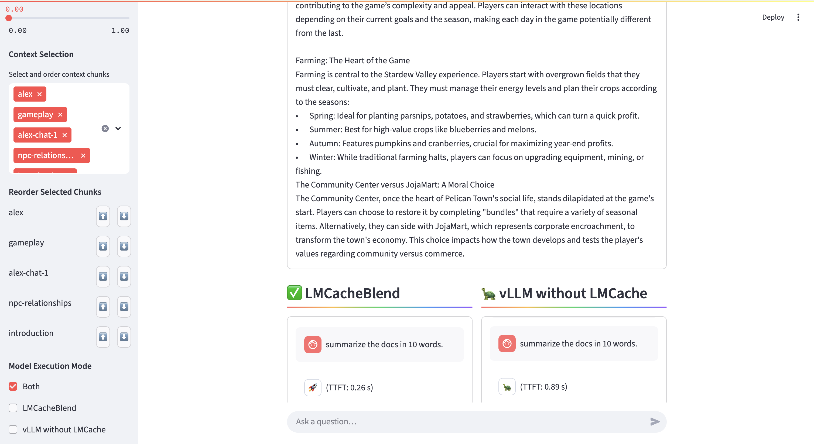

# KV Cache Blending Demo w/ Chat UI


## Overview

This project demonstrates the benefits of LMCache's Key-Value (KV) cache blending feature for Large Language Models (LLMs) using vLLM. It provides a side-by-side chat interface to compare the performance of a vLLM instance with CacheBlend enabled against a standard vLLM instance.

The UI allows users to dynamically construct long contexts by selecting and reordering text chunks.

## Features

- **Dynamic Context Building:** Select and reorder text chunks to form the input context for the LLMs.
- **Dual LLM Companions:** Interact with two vLLM instances:
    - One with LMCache + KV blending enabled.
    - One standard vLLM instance.
- **Side-by-Side Chat UI:** You can select which instance to run & view responses from both LLMs in parallel for easy comparison.
- Uses `mistralai/Mistral-7B-Instruct-v0.2` by default.

## Prerequisites

- **Docker:** Ensure Docker is installed and running. ([Docker Install Guide](https://docs.docker.com/engine/install/))
- **NVIDIA GPU & Drivers:** 2x NVIDIA GPUs with appropriate drivers is required for vLLM.
- **NVIDIA Container Toolkit:** Necessary for Docker to access GPUs. ([Installation Guide](https://docs.nvidia.com/datacenter/cloud-native/container-toolkit/latest/install-guide.html))
- **Python 3.11+:**
- **Bash environment**
- **Hugging Face Token:** `mistralai/Mistral-7B-Instruct-v0.2` (or any private model) requires authentication.

## Project Structure

```
demo-rag-blending/
├── backend/
├── data/                         # Text chunks and system prompt for context building
│   ├── sys_prompt.txt            # System prompt for the LLMs
│   ├── abi.txt, alex.txt, ...    # Main document chunks
│   └── ...                       # (Add your own .txt files here)
├── frontend/
│   ├── app.py                    # Streamlit frontend application
│   ├── chat_session.py           # Helper for API communication
├── run-server-blend.sh           # Script to start LMCache+Blending backend (GPU 0)
├── run-server-default.sh         # Script to start default vLLM backend (GPU 1)
├── llm_backend_blend.py          # Entrypoint for LMCache+Blending backend
├── llm_backend_no_blend.py       # Entrypoint for default vLLM backend
├── requirements.txt              # Python dependencies for the frontend
├── Dockerfile                    # Patches
├── demo.gif                      # Demo animation for README
└── README.md                     # This file
```

## Setup and How to Run

1.  **Clone the Repository:**
    ```bash
    git clone <repository-url>
    cd demo-kv-blending-new
    ```

2.  **Configure Environment Variables:**
    - Set the Hugging Face token in your shell environment:
      ```bash
      export HF_TOKEN="your_hf_token_here"
      ```
    - (Optional) If your Hugging Face cache is not at the default location, set `LOCAL_HF_HOME`:
      ```bash
      export LOCAL_HF_HOME="/path/to/your/huggingface/cache"
      ```
    - The scripts will use these environment variables for authentication and cache mounting.

3.  **Start Backend Servers:**
    - Open **two terminals**:
      - In the first terminal, start LMCache + Blending (uses GPU 0, listens on port 8000):
        ```bash
        bash run-server-blend.sh
        ```
      - In the second terminal, start the default vLLM server (uses GPU 1, listens on port 8001):
        ```bash
        bash run-server-default.sh
        ```
    - Logs will print out directly in each terminal for monitoring.
    - **You can test the servers with curl:**
      ```bash
      # Test LMCache + Blending (port 8000)
      curl -X POST http://localhost:8000/generate \
           -H "Content-Type: application/json" \
           -d '{"prompt": "What is the capital of France?", "max_tokens": 12, "req_str": "demo"}'

      # Test default vLLM (port 8001)
      curl -X POST http://localhost:8001/generate \
           -H "Content-Type: application/json" \
           -d '{"prompt": "What is the capital of France?", "max_tokens": 12, "req_str": "demo"}'
      ```

4.  **Install Frontend Dependencies:**
    ```bash
    pip install -r frontend/requirements.txt
    ```

5.  **Run the Streamlit Frontend:**
    Once the backend servers are ready:
    ```bash
    streamlit run frontend/app.py
    ```

## How to Use the UI

1.  **Configure Settings (Sidebar):**
    - **System Prompt:** The system prompt being used is displayed. You can change it by editing `data/sys_prompt.txt` and restarting the frontend (backend servers don't need a restart for sys prompt changes handled by frontend).
    - **Temperature:** Adjust the generation temperature for the LLMs.
    - **Context Selection:** Use the multiselect dropdown to choose which text chunks from the `data/` directory are included in the context. You can also reorder them. The selected chunks will be concatenated with the system prompt.

2.  **View Context:**
    - The fully constructed context (system prompt + selected chunks + separators for LMCache view) is displayed, along with its token count. This is the input that will be processed by the LLMs.

3.  **Chat:**
    - **Dual Chat Panes:** You'll see two chat areas:
        - **vLLM with LMCache** (left, 🚀 icon)
        - **vLLM without LMCache** (right, 🐢 icon)
    - **Model Execution Mode:** In the sidebar, under 'Model Execution Mode', you can choose to send requests to both servers at the same time or to only one server at a time by checking the corresponding boxes.
    - **Ask a Question:** Type your question in the input box at the bottom ("Ask a question to both LLMs...") and press Enter.
    - **View Responses:** Responses from each LLM instance will stream into their respective panes. Observe differences in TTFT (time-to-first-token).

4.  **Chat History:**
    - The conversation is stored and displayed.

## Example Result

You will see something like this in chat UI:



In this example, there is a **3.42× reduction in TTFT** ⚡ compared to the default vLLM.